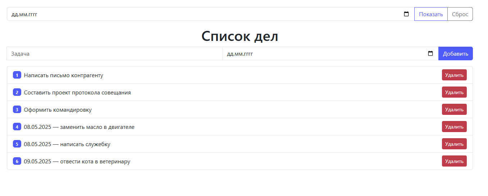

# 📝 Приложение ToGetApp — Список дел

Web-приложение "Список дел" на базе **Spring Boot**, позволяет:

- Добавлять задачи
- Удалять задачи
- Назначать задачи на конкретные даты
- Фильтровать задачи по дате

Стек: Thymeleaf, Lombok, Bootstrap, JPA/Hibernate.

---

## 🧾 Описание

Приложение позволяет выполнять функции:
✅ Добавление задач  
✅ Удаление задач  
✅ Выбор даты выполнения  
✅ Фильтрация задач по дате  
✅ Отображение нумерованного списка  

## 🖼 Скриншот

